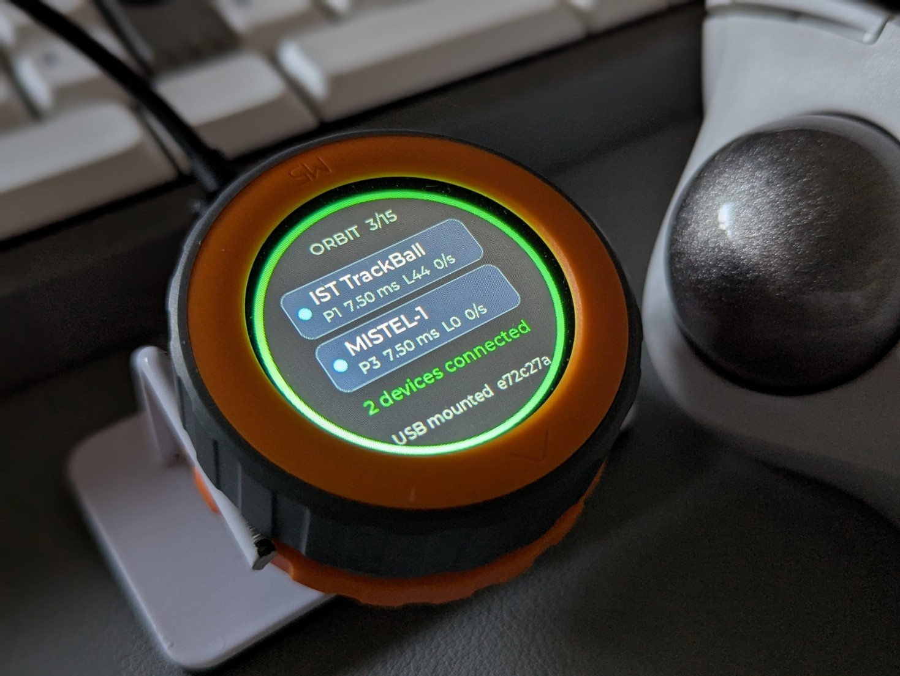

# ふだんの使い方

## 画面の見方

| 場所 | 内容 |
| --- | --- |
| 上の `ORBIT 3/15` | 登録した機器の数 / 登録できる上限（15 台） |
| カード（2 枚） | つながっている機器。名前と、`P1  7.50 ms  L0  120/s`（ポート番号、通信の間隔、機器が通信を休んでよい回数、1 秒あたりの入力の数） |
| 状態の行 | 今の状態（下の表） |
| 下の `USB mounted e72c27a` | PC との USB のつながり（`mounted` なら使える状態）と、ファームウェアの版 |
| 外側のリング | 状態の色（下の表） |

| リングの色 | 意味 | 状態の行の例 |
| --- | --- | --- |
| 緑 | 登録した機器がつながっている | `2 devices connected` |
| 青 | 登録した機器が現れるのを待っている | `Waiting for 2 device(s)`、`1 connected, waiting` |
| 黄 | ペアリング待ち、または確認してほしいことがある | `Pairing 95s: turn on device`、`Two rows look alike: check them` |
| 赤 | 操作が必要 | `Port 1 asks to pair: press (42s)`、`All 15 ports used: forget one` |
| 灰 | まだ 1 台も登録していない | `No device paired yet` |

## ダイヤルとボタン

| 操作 | 内容 |
| --- | --- |
| ダイヤルを回す | カードを選ぶ（選んだカードは青い枠）。メニューでは項目を選ぶ |
| 中央を短く押す | メニューを開く。メニューでは選んだ項目を実行する。赤いリングで許可を求められているときは、許可する |
| 中央を 2 秒押し続ける | ペアリング待ちを始める。ペアリング待ちのときは、やめる |

メニューの項目：

| 項目 | 内容 |
| --- | --- |
| Pair new device / Stop pairing | ペアリング待ちを始める / やめる |
| Allow port N | 登録済みの機器が組み直しを求めているとき、許可する（下の「組み直しの許可」） |
| Forget port N | 選んだカードの機器を消す。もう一度押して確定（`Really forget?`）。カードを選んでいるときだけ出る |
| Open config page | 本家の Web 設定ツールのアドレスを、Orbit が PC に打ち込む。選ぶと手順が出るので、PC の Chrome でアドレス欄をクリックしてから、中央を押す。回すとやめる（[リマップの設定](configuration.md#設定ツールを開く)） |
| Rotate | 画面を 90 度ずつ回す |
| Screen off | 画面を消すまでの時間（never、30 s、2 min、10 min） |
| Close | メニューを閉じる。何もしなければ 15 秒で閉じる |

画面の向きと消すまでの時間は、本体に保存され、電源を切っても残ります。

画面が消えているときは、最初の操作で画面がつくだけで、ほかには何もしません。許可を求められたとき、ペアリング待ちを始めたとき、登録がいっぱいのときは、画面が自動でつきます。

## 機器を足す

1. 中央を 2 秒押し続けるか、メニューの「Pair new device」を選びます。リングが黄色になります。
2. 足したい機器をペアリング待ちにします。
3. つながると、カードが出ます。

ペアリング待ちは 2 分でやめます（1 台も登録していないときは、やめません）。

**同時につながるのは 2 台です。** 登録は 15 台までできます。3 台目以降は、登録した機器のうち、先に現れた 2 台がつながります。

## 機器を消す

ダイヤルで消したい機器のカードを選び、メニューの「Forget port N」を 2 回押します。機器の側でも、Orbit のペアリング情報を消してください。消さないままだと、次にペアリングするときに失敗することがあります。

## ポート番号

登録した機器には、1〜15 のポート番号が 1 つずつ付きます。空いている一番小さい番号が付き、あとから変わりません。1 台消しても、ほかの機器の番号はずれません。リマップの設定で「この機器だけ」を指定するときに、この番号を使います（[リマップの設定](configuration.md)）。

リセットするとアドレスが変わる機器（MD600 など）をペアリングし直したときは、同じ機器らしい古い登録を探して、番号を引き継ぎます。同じ機器らしい登録が 2 つ以上あるときは引き継がず、`Two rows look alike: check them` と出します。どちらかを消してください。

## 組み直しの許可

登録済みの機器が、新しい鍵でつなぎ直そうとしたとき（機器の側でペアリングをやり直したときなど）は、Orbit はすぐにはつなぎません。乗っ取りを防ぐためです。

1. リングが赤になり、`Port 1 asks to pair: press (60s)` と出ます。
2. 自分の操作なら、60 秒以内に中央を短く押します。その機器に限って、60 秒の間、ペアリングし直しを受け付けます。
3. 心当たりがなければ、押さずに待ちます。60 秒で取り下げます。3 回取り下げた機器は、再起動するまで聞きません。

## PC からの操作（上級者向け）

Orbit のログの COM ポート（115200 bps）に、次の命令を 1 行ずつ打てます。

| 命令 | 内容 |
| --- | --- |
| `orbit list` | 登録した機器の一覧 |
| `orbit forget <ポート>` | その機器を消す |
| `orbit move <新ポート> <旧ポート>` | 新ポートの機器に、旧ポートの番号を引き継がせる（旧ポートの機器は消える） |
| `orbit alias <ポート> <名前>` | 画面に出す名前を付ける（24 バイトまで。空にすると消える） |
| `orbit pair` / `orbit stop` | ペアリング待ちを始める / やめる |
| `orbit approve` | 組み直しを許可する |
